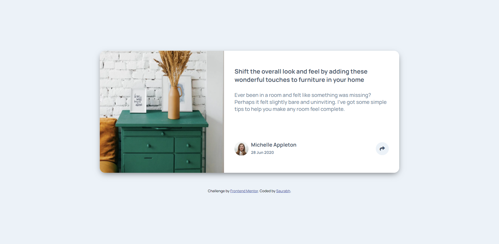
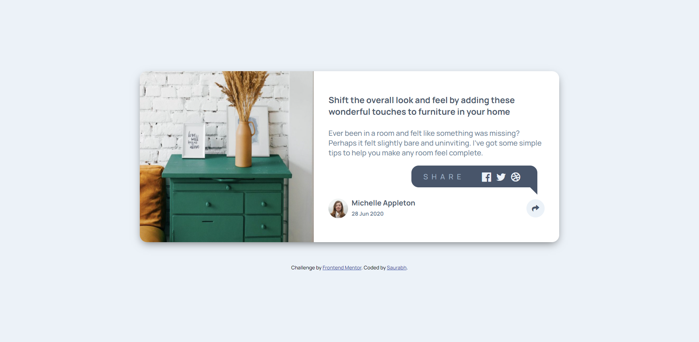
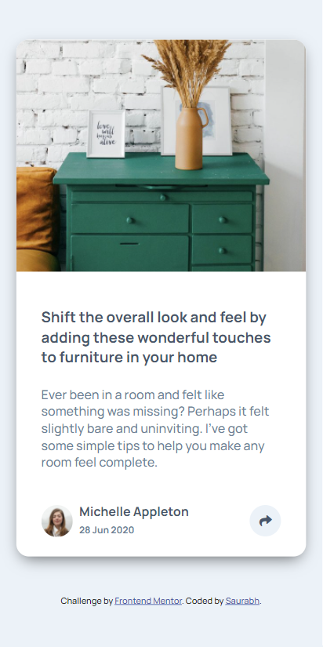
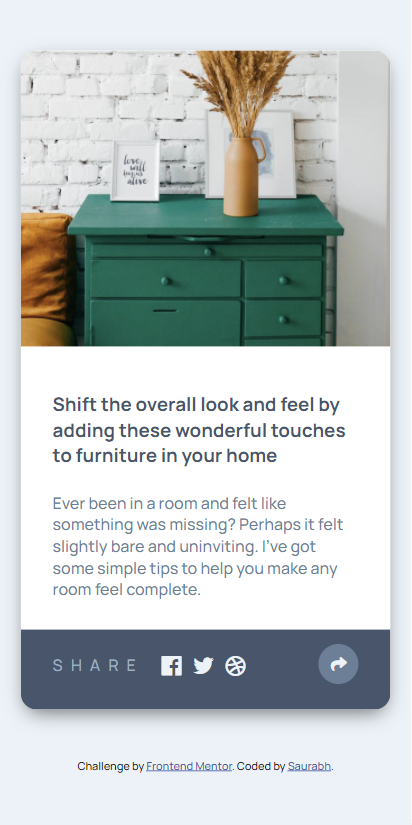

# Frontend Mentor - Article preview component solution

This is a solution to the [Article preview component challenge on Frontend Mentor](https://www.frontendmentor.io/challenges/article-preview-component-dYBN_pYFT). Frontend Mentor challenges help you improve your coding skills by building realistic projects. 

## Table of contents

- [Overview](#overview)
  - [The challenge](#the-challenge)
  - [Screenshot](#screenshot)
  - [Links](#links)
- [My process](#my-process)
  - [Built with](#built-with)
  - [What I learned](#what-i-learned)
  - [Continued development](#continued-development)
  - [Useful resources](#useful-resources)
- [Author](#author)
- [Acknowledgments](#acknowledgments)


## Overview

### The challenge

Users should be able to:

- View the optimal layout for the component depending on their device's screen size
- See the social media share links when they click the share icon
- See animation effects as they click on the share icon.
- Animation for social icons on hover.

### Screenshot

#### Desktop-Page


#### Desktop-Page-active


#### Mobile-Page


#### Mobile-Page-active




### Links

- Solution URL: [Add solution URL here](https://your-solution-url.com)
- Live Site URL: [Add live site URL here](https://your-live-site-url.com)

## My process

### Built with

- Semantic HTML5 markup
- Mobile-first workflow
- SASS
- Flexbox


### What I learned

I've tried to impose the best readability for the viewers and hence modified the design a bit in desktop section so the description is still visible as the share button is clicked. I also experimented with keyframe animations to make it even cooler.

To see how, see below:


```css
@keyframes social {
    from {
      opacity: 0;
      right: -30%;
    }
    to {
      opacity: 1;
      right: 0;
    }
  }
```

### Continued development

I'll be focusing more on the JavaScript functionality section all along with challenging CSS Styles. Will also be researching on animate-out so that once implemented will be even cooler.

### Useful resources

- [W3 Schools](https://www.w3schools.com/) - This has been my first line of contact when I was stuck at stages. It usually solved all my quests.


## Author

- Frontend Mentor - [@yourusername](https://www.frontendmentor.io/profile/@saurabh1996-rex)


## Acknowledgments

Always thankful to Frontendmentor.io as they've provided all the necessary files so that it was easier to work with the project. Also special metion to the one who have designed this project, Great Work!
